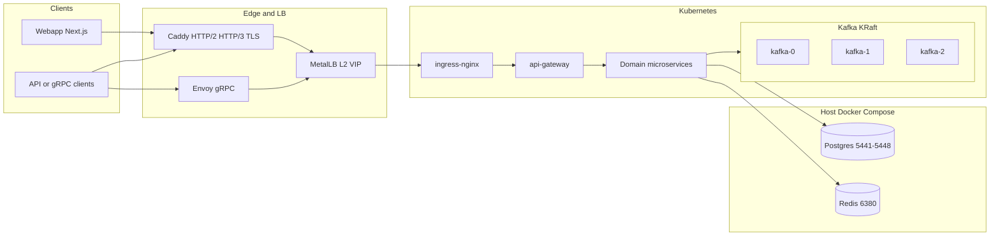
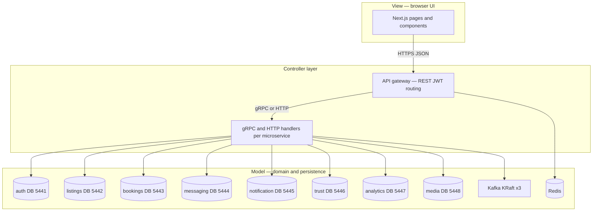
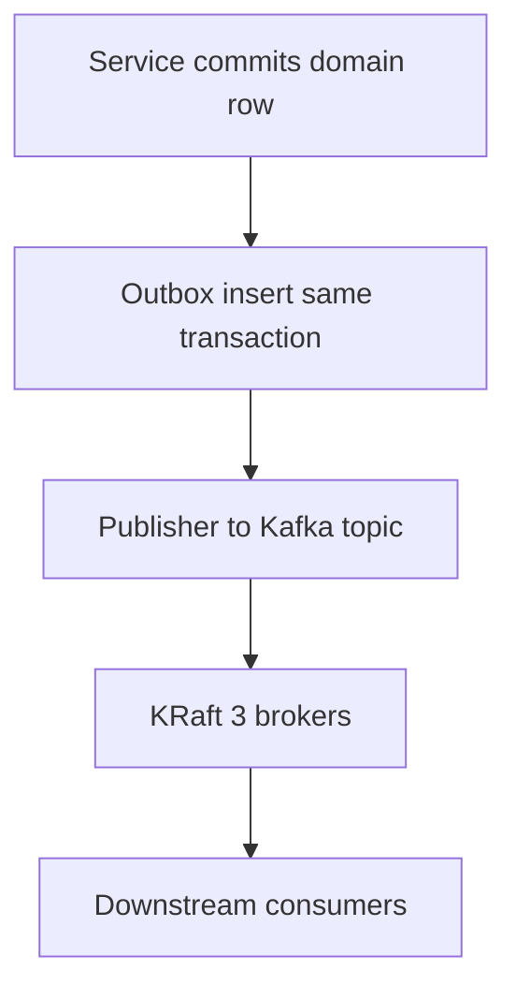
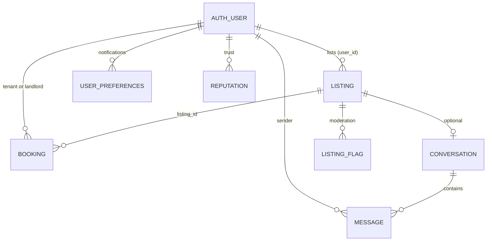

# Engineering deliverable report — sections 2.1 through 2.5 (complete)

This file is the **single filled-out deliverable** for submission or review. **Section 2.4 (technology stack)** is written to be **self-contained**: you can copy it into **Google Docs** without opening other files—see the note at the start of §2.4. Optional repo paths and commands elsewhere in this document are for developers regenerating screenshots or schema reports.

**Regenerating artifacts**

| Artifact | Command |
|----------|---------|
| DB schema report (source for §2.3) | `./scripts/inspect-external-db-schemas.sh reports` → `reports/schema-report-<timestamp>.md` |
| UI PNGs (§2.2) | From repo root: `cd webapp && E2E_SCREENSHOTS=1 ./node_modules/.bin/playwright test e2e/ui-screenshots.spec.ts --project=05-optional-screenshots` (requires reachable `baseURL` from [`webapp/playwright.config.ts`](../webapp/playwright.config.ts), typically `https://off-campus-housing.test`). Optional: `E2E_SCREENSHOTS=1 ./scripts/webapp-playwright-strict-edge.sh e2e/ui-screenshots.spec.ts` with certs/host set up. |

*Versioned copies for this deliverable:* PNGs are also stored under [`docs/assets/deliverable-ui/`](assets/deliverable-ui/) (synced from Playwright output) so images render in Git and PDF exports without relying on `webapp/.gitignore` (which ignores `/e2e/screenshots/*.png`). Regenerate with the commands above, then `cp webapp/e2e/screenshots/0*.png docs/assets/deliverable-ui/`.

---

## 2.1 Architecture diagram

This section answers the **architecture guideline** in one place: **(1)** diagrams including **frontend → backend → database** flow, **(2)** an **MVC-style** reading of the system, **(3)** **object-oriented** design (separation of concerns, encapsulation, abstraction, modularity), **(4)** **major components** (all application services and key infra), and **(5)** **classes / modules** and their responsibilities. **MetalLB** is part of the **edge path** in-cluster and is justified in **§2.4.8**.

### 2.1.1 Diagram: layers, MetalLB, and request path

The system follows **client → edge (TLS, MetalLB-backed LoadBalancer where enabled) → Kubernetes ingress → API gateway → domain microservices → data stores**. Browsers and REST clients use **Caddy** (HTTP/2, HTTP/3). gRPC clients use **Envoy**. **MetalLB** (Layer 2 mode in local setups) assigns a **real routable IP** to a **LoadBalancer**-type **Service** for the edge, so the stack behaves like a **cloud load balancer** even on bare-metal-like **k3s**—this matters for **HTTP/3 (QUIC)** and TLS SNI testing to a stable VIP, not only **NodePort** on arbitrary high ports. Traffic then reaches **ingress-nginx**, the **api-gateway**, and eight **housing microservices**. **PostgreSQL** (eight instances, ports **5441–5448**) and **Redis** run on the **host** via **Docker Compose** and are reached from pods through **Kubernetes Services and Endpoints**.

**Kafka** has two shapes: **(1)** **Three KRaft brokers** in-cluster (StatefulSet, TLS, manifests under **infra/k8s/kafka-kraft-metallb**). **(2)** **CI** may start **one** TLS broker (ZooKeeper + Kafka) for speed; **pipelines** still assert **replicas: 3** on the KRaft YAML.

### 2.1.2 Flowchart: frontend, backend, and databases

This view matches the rubric’s example of **data flow between frontend, backend, and database** components. The **webapp** never opens a Postgres connection; it calls **HTTPS APIs**. Each **backend service** talks to **its own** database only.

### 2.1.3 MVC-style design (how components interact)

Classic **MVC** maps to this system as follows (names are **analogous**; the implementation is distributed):

| MVC role | Where it lives in this project | Interaction |
|----------|--------------------------------|-------------|
| **View** | **Next.js webapp** | Renders UI, collects input, calls the public **REST API** over HTTPS. No direct SQL. |
| **Controller** | **API gateway** (HTTP middleware, auth, proxy) **plus** each service’s **route and gRPC handlers** | Parses requests, applies policy (JWT, rate limits), delegates to domain logic, maps responses. |
| **Model** | **Domain services** with **business rules**, **Prisma or SQL** access, **outbox** writers, and **Kafka** producers/consumers | Encapsulates persistence and invariants; exposes behavior through **APIs** and **events**, not shared tables. |

**Separation:** the View does not embed business rules for bookings or trust; those live in **booking-service** and **trust-service**. The gateway **coordinates** but does not own listing rows. That is the same **separation of concerns** MVC promotes, stretched across **network boundaries**.

### 2.1.4 Event path (async domain integration)

### 2.1.5 Object-oriented principles (encapsulation, abstraction, modularity)

The project uses **TypeScript** and **microservices**, so “OO” appears both as **language-level types** and as **architectural boundaries**.

| Principle | How it is applied |
|-----------|-------------------|
| **Encapsulation** | Each service **hides** its database and internal types. Other services see only **RPC contracts** and **events**. No cross-database foreign keys. |
| **Abstraction** | **Protocol Buffers** define **abstract** service and event interfaces; implementations can change if the contract stays compatible. **Redis Lua** hides cache algorithms behind keys. |
| **Modularity** | One **deployable** per domain service; **shared library** (**services/common**) for cross-cutting utilities without merging business domains. **Kustomize** modules for Kubernetes. |
| **Separation of concerns** | Auth does not write listing rows; analytics does not mutate booking state. Edge (**Caddy/Envoy/MetalLB/ingress**) is separate from application logic. |

Node.js code often uses **modules and functions** instead of deep **class hierarchies**; that is still **modular** design: **cohesive files**, **explicit exports**, and **dependency injection** via factory functions where used.

### 2.1.6 Complete inventory: application services and supporting software

| Name | Type | Responsibility |
|------|------|----------------|
| **webapp** | Application (Next.js) | User interface, routing, client and server components; consumes REST/HTTPS APIs. |
| **api-gateway** | Application | Single HTTP entry: JWT verification, rate limiting, proxy to microservices, Redis-backed revocation. |
| **auth-service** | Application | Identity, sessions, MFA/passkeys, verification; **auth** database only (Prisma). |
| **listings-service** | Application | Listings CRUD, search, geo; **listings** DB; Kafka outbox/events as designed. |
| **booking-service** | Application | Booking lifecycle and DB state machine; **bookings** DB. |
| **messaging-service** | Application | Conversations, messages, related schemas; **messaging** DB. |
| **notification-service** | Application | User preferences and notification fan-out; **notification** DB. |
| **trust-service** | Application | Flags, reputation, moderation-related persistence; **trust** DB. |
| **analytics-service** | Application | Event ingestion, projections, metrics tables; **analytics** DB. |
| **media-service** | Application | Media metadata, uploads, integration with object storage; **media** DB. |
| **cron-jobs** | Application | Scheduled or batch tasks (workspace package). |
| **transport-watchdog** | Application | Small TypeScript service (Redis client) supporting **transport** monitoring or watchdog behavior in the stack. |
| **event-layer-verification** | Application / tooling | Vitest-backed checks and mocks for **outbox**, **idempotent consumers**, and event-layer contracts. |
| **services/common** | Shared library | Metrics, gRPC helpers, TLS helpers, auth utilities—**not** a runtime “service.” |
| **Caddy** | Infrastructure | TLS, HTTP/2, HTTP/3 to browsers and REST. |
| **Envoy** | Infrastructure | gRPC ingress; correct framing and trailers. |
| **MetalLB** | Infrastructure | LoadBalancer IPs for Services (e.g. edge) on clusters without a cloud LB. |
| **ingress-nginx** | Infrastructure | In-cluster HTTP routing by host/path. |
| **Kafka (KRaft ×3)** | Infrastructure | Durable event log, in-cluster StatefulSet. |
| **PostgreSQL ×8** | Infrastructure / data | One database per bounded context (Compose on host in dev). |
| **Redis** | Infrastructure / data | Cache, rate limits, revocation lists. |
| **MinIO** | Infrastructure / data | Object storage for media workflows (Compose). |

### 2.1.7 Major classes, servers, and modules (responsibilities)

| Artifact | Kind | Responsibility |
|----------|------|----------------|
| **Express application** (api-gateway) | HTTP stack | Composes **middleware** (security, rate limit, proxy, metrics)—**controller** behavior in the HTTP sense. |
| **grpc.Server** (each microservice) | gRPC runtime | Hosts **service implementations** registered from **generated gRPC server stubs**; enforces **mTLS** where configured. |
| **HealthService** (shared library) | Class | Standard **gRPC health** checks used across services for readiness probes. |
| **PrismaClient** (auth, booking, messaging where used) | Class / ORM | **Data access** and migrations for relational models—**model** layer for those services. |
| **Generated gRPC clients** | Modules | **Abstract** remote calls to other services; callers depend on **interfaces**, not wire format. |
| **Proto definitions** (.proto files) | Contract | **Abstraction** of RPC methods and event messages; source for codegen. |
| **Domain handler modules** | Functions / modules | Implement **use cases** (create listing, confirm booking) with **single responsibility** per area of a service. |

Together, these show **class structure** where the runtime uses classes (**grpc.Server**, **PrismaClient**, **HealthService**) and **modular** TypeScript elsewhere, all under the same **encapsulation** rules: **public API** at the edge of each service, **private** persistence inside.

---

## 2.2 UI design

**Section status:** Filled out with **seven** full-page screenshots (home, auth pair, listings, mission, trust, analytics). Screenshots are **full-page captures** from Playwright ([`webapp/e2e/ui-screenshots.spec.ts`](../webapp/e2e/ui-screenshots.spec.ts)) and are versioned under [`docs/assets/deliverable-ui/`](assets/deliverable-ui/) for this report.

**Profile / activity:** Registration and login flows establish identity; listings and analytics pages reflect **activity-oriented** views (inventory browse, metrics). A dedicated “user profile” page may be extended in the app; the rubric’s profile/dashboard examples are represented here by **login**, **register**, **listings (guest)**, and **analytics**.

### 2.2.1 Home and auth

### 2.2.2 Listings and informational pages

### 2.2.3 Dashboard-style view (metrics)

---

## 2.3 Data model

**Section status:** Filled out with a **conceptual ER diagram**, a **verbatim** schema inspection run (embedded below), and narrative explanation.

### 2.3.1 How data is structured

Data is **partitioned by bounded context**: one **PostgreSQL database per major service** (plus optional **forum/messages** schemas inside the messaging port where applied). **Kafka** carries **immutable domain events**; **outbox** and **processed_events** tables support **at-least-once** publishing and **idempotent** consumption (see `infra/db/*-outbox.sql` and contract docs).

**Logical relationships** (e.g. `listing_id`, `user_id`) are enforced by **application code and events**, not foreign keys across databases.

### 2.3.2 Entity–relationship view (conceptual)

### 2.3.3 Live schema inspection output (`inspect-external-db-schemas.sh`)

Standalone copy (same run): [`docs/assets/schema-inspection-20260401-144232.md`](assets/schema-inspection-20260401-144232.md).

The following block is the **verbatim report** produced by:

`./scripts/inspect-external-db-schemas.sh reports`

on **2026-04-01** (file: `reports/schema-report-20260401-144232.md`). It lists **actual** tables and sizes from `127.0.0.1`, compares to **expected** tables encoded in the script (aligned with `infra/db` and auth), and ends with an integrity summary.

<strong>Click to expand embedded schema report</strong> (same content as the generated <code>.md</code> file)

<!-- BEGIN embedded schema-report-20260401-144232.md -->

# External DB schema report — 20260401-144232

Generated: 2026-04-01T14:42:32-04:00

Host: `127.0.0.1` (user: postgres).

Inspected DB targets:

| Port | DB | Label |
|------|----|-------|
| `5441` | `auth` | `auth` |
| `5442` | `listings` | `listings` |
| `5443` | `bookings` | `bookings` |
| `5444` | `messaging` | `messaging` |
| `5445` | `notification` | `notification` |
| `5446` | `trust` | `trust` |
| `5447` | `analytics` | `analytics` |
| `5448` | `media` | `media` |

---

## Port 5441 — auth (`auth`)

### Actual tables (from DB)

 schema |     table_name     |  size  
--------+--------------------+--------
 auth   | mfa_settings       | 136 kB
 auth   | oauth_providers    | 40 kB
 auth   | passkey_challenges | 40 kB
 auth   | passkeys           | 56 kB
 auth   | sessions           | 24 kB
 auth   | user_addresses     | 40 kB
 auth   | users              | 480 kB
 auth   | verification_codes | 120 kB
(8 rows)

### Expected tables (from infra/db and auth dump)

| schema.table |
|--------------|
| `auth.users` |
| `auth.sessions` |
| `auth.mfa_settings` |
| `auth.oauth_providers` |
| `auth.passkeys` |
| `auth.passkey_challenges` |
| `auth.verification_codes` |
| `auth.user_addresses` |

### Integrity check

✅ **Match** — All expected tables present.

## Port 5442 — listings (`listings`)

### Actual tables (from DB)

  schema  |    table_name    |    size    
----------+------------------+------------
 listings | listing_media    | 24 kB
 listings | listings         | 256 kB
 listings | outbox_events    | 24 kB
 listings | processed_events | 8192 bytes
(4 rows)

### Expected tables (from infra/db and auth dump)

| schema.table |
|--------------|
| `listings.listings` |
| `listings.outbox_events` |
| `listings.processed_events` |

### Integrity check

✅ **Match** — All expected tables present.

## Port 5443 — bookings (`bookings`)

### Actual tables (from DB)

 schema  |   table_name    |  size   
---------+-----------------+---------
 booking | bookings        | 192 kB
 booking | outbox_events   | 24 kB
 booking | search_history  | 1928 kB
 booking | watchlist_items | 416 kB
(4 rows)

### Expected tables (from infra/db and auth dump)

| schema.table |
|--------------|
| `booking.bookings` |
| `booking.outbox_events` |

### Integrity check

✅ **Match** — All expected tables present.

## Port 5444 — messaging (`messaging`)

### Actual tables (from DB)

  schema   |        table_name         |  size  
-----------+---------------------------+--------
 forum     | comment_attachments       | 120 kB
 forum     | comment_votes             | 112 kB
 forum     | comments                  | 152 kB
 forum     | post_attachments          | 120 kB
 forum     | post_votes                | 112 kB
 forum     | posts                     | 504 kB
 messages  | group_bans                | 88 kB
 messages  | group_members             | 128 kB
 messages  | groups                    | 120 kB
 messages  | message_attachments       | 120 kB
 messages  | message_reads             | 112 kB
 messages  | messages                  | 992 kB
 messages  | user_archived_threads     | 72 kB
 messages  | user_deleted_threads      | 72 kB
 messaging | conversation_participants | 24 kB
 messaging | conversations             | 56 kB
 messaging | messages                  | 96 kB
 messaging | outbox_events             | 96 kB
(18 rows)

### Expected tables (from infra/db and auth dump)

| schema.table |
|--------------|
| `messaging.conversations` |
| `messaging.messages` |
| `messaging.outbox_events` |

### Integrity check

✅ **Match** — All expected tables present.

## Port 5445 — notification (`notification`)

### Actual tables (from DB)

    schema    |    table_name    |  size  
--------------+------------------+--------
 notification | notifications    | 128 kB
 notification | outbox_events    | 24 kB
 notification | processed_events | 24 kB
 notification | user_preferences | 24 kB
(4 rows)

### Expected tables (from infra/db and auth dump)

| schema.table |
|--------------|
| `notification.user_preferences` |
| `notification.outbox_events` |

### Integrity check

✅ **Match** — All expected tables present.

## Port 5446 — trust (`trust`)

### Actual tables (from DB)

 schema |    table_name    |    size    
--------+------------------+------------
 trust  | listing_flags    | 80 kB
 trust  | outbox_events    | 24 kB
 trust  | processed_events | 8192 bytes
 trust  | reputation       | 8192 bytes
 trust  | reviews          | 40 kB
 trust  | user_flags       | 40 kB
 trust  | user_spam_score  | 40 kB
 trust  | user_suspensions | 32 kB
(8 rows)

### Expected tables (from infra/db and auth dump)

| schema.table |
|--------------|
| `trust.outbox_events` |
| `trust.processed_events` |
| `trust.reputation` |
| `trust.user_spam_score` |

### Integrity check

✅ **Match** — All expected tables present.

## Port 5447 — analytics (`analytics`)

### Actual tables (from DB)

  schema   |         table_name         |    size    
-----------+----------------------------+------------
 analytics | daily_metrics              | 24 kB
 analytics | events                     | 40 kB
 analytics | listing_feel_cache         | 24 kB
 analytics | processed_events           | 24 kB
 analytics | projection_state           | 16 kB
 analytics | projection_versions        | 16 kB
 analytics | recommendation_experiments | 16 kB
 analytics | recommendation_models      | 24 kB
 analytics | recommendation_weights     | 16 kB
 analytics | user_activity              | 8192 bytes
 analytics | user_listing_engagement    | 16 kB
 analytics | user_watchlist_daily       | 8192 bytes
(12 rows)

### Expected tables (from infra/db and auth dump)

| schema.table |
|--------------|
| `analytics.events` |
| `analytics.processed_events` |
| `analytics.daily_metrics` |

### Integrity check

✅ **Match** — All expected tables present.

## Port 5448 — media (`media`)

### Actual tables (from DB)

 schema |  table_name   |  size  
--------+---------------+--------
 media  | media_files   | 104 kB
 media  | outbox_events | 88 kB
(2 rows)

### Expected tables (from infra/db and auth dump)

| schema.table |
|--------------|
| `media.media_files` |
| `media.outbox_events` |

### Integrity check

✅ **Match** — All expected tables present.

---

## Data integrity summary

✅ All DBs match expected schema (from infra/db and auth dump). Safe to run tests.

<!-- END embedded schema-report-20260401-144232.md -->

### 2.3.4 Explanation (beyond the raw report)

- **Expected vs actual:** The script encodes a **minimum contract** per port (tables that must exist for CI and housing flows). **Additional** tables (e.g. `booking.search_history`, `notification.notifications`, forum/messages schemas on 5444) may exist without failing the check, as long as required tables are present.
- **Per-domain narrative:** Column-level design, triggers, and state machines are documented in [`infra/db/README.md`](../infra/db/README.md) and SQL files under [`infra/db/`](../infra/db/).
- **Regeneration:** Re-run the script after migrations or restores; copy the new `reports/schema-report-*.md` into this deliverable or replace the `
` block to stay current.

---

## 2.4 Technology stack with justification (in depth)

### Copying section 2.4 into Google Docs

Select from the heading **2.4 Technology stack** through the end of subsection **2.4.12** (or stop before **2.4.12** if you omit the one-page summary) and paste into Google Docs. Use **Paste without formatting** first, then re-apply headings with Docs styles (Heading 2 for 2.4.x). Mermaid diagrams in section 2.1 do not render in Docs; insert screenshots or redraw shapes there if needed. This section does **not** require linking to any other document for graders to understand the technology choices.

---

### 2.4.0 Quick reference (stack at a glance)

| Layer | Technologies | Primary role |
|-------|----------------|--------------|
| Edge | Caddy, Envoy, ingress-nginx | TLS, HTTP/2, HTTP/3 to browsers; gRPC on a separate proxy |
| Apps | Node.js 20, TypeScript, Express, Next.js | Microservices, API gateway, web UI |
| RPC & events | gRPC, Protocol Buffers, Kafka | Sync calls; async domain events |
| Relational data | PostgreSQL 16 (eight separate databases) | One database per bounded context |
| Cache | Redis 7, Lua scripts | Revocation, rate limits, cache stampede control |
| Messaging | Kafka KRaft, three brokers in Kubernetes | Durable events; quorum; TLS |
| CI Kafka | Single TLS broker (ZooKeeper + Kafka) | Fast integration tests only |
| Runtime | Kubernetes (k3s / Colima locally), Kustomize | Deployments, secrets, ingress |
| Load balancer (local) | MetalLB | LoadBalancer IPs for edge testing |
| IaC / automation | Terraform, Ansible, Make, shell scripts | Repeatable bring-up |
| Observability | Prometheus, Grafana, Jaeger, OpenTelemetry | Metrics, dashboards, traces |
| Testing | Vitest, Playwright, k6, xk6-http3, shell checks | Unit/integration, browser, load, infra validation |

---

### 2.4.1 Clients, edge proxies, and ingress

End users and most API clients speak **HTTPS** to the platform. **Caddy** terminates TLS and serves modern HTTP: **HTTP/2** and **HTTP/3 (QUIC)**. It uses a readable configuration format (Caddyfile) and includes an admin interface useful for configuration reloads. That combination is strong for **browser traffic**, **REST JSON**, and **static assets**.

**gRPC** must not use the same Caddy path in this architecture. Caddy has historically treated gRPC like ordinary HTTP in ways that break **framing**, **trailers**, and **status mapping**. The same Node gRPC servers that work behind **Envoy** failed behind Caddy in this project’s investigations. Therefore **Envoy** is the dedicated **gRPC entry** (commonly on port 10000 in the documented layout). Envoy understands gRPC as a first-class protocol: correct **HEADERS/DATA** ordering, **trailers**, and error propagation.

**ingress-nginx** sits in Kubernetes and routes by hostname and path into cluster services (for example toward the API gateway and static frontends). **MetalLB** (see **§2.4.8**) can sit **in front of** or **alongside** the Service type **LoadBalancer** so the edge gets a **stable IP** on clusters without AWS/GCP load balancers.

The design choice is intentional **separation of concerns** at the edge: one proxy optimized for QUIC and web TLS, another optimized for gRPC over HTTP/2. The cost is **two configurations** and two processes to operate. The benefit is **provable correctness** under test for both traffic types, which matters for a project that explicitly validates HTTP/1.1, HTTP/2, HTTP/3, and gRPC.

---

### 2.4.2 Application runtime: Node.js, TypeScript, Express, and Next.js

All backend microservices and the **API gateway** run on **Node.js version 20**. **TypeScript** adds static types across HTTP handlers, shared libraries, and generated gRPC code. That reduces whole classes of integration bugs compared to untyped JavaScript at this scale.

**Express** provides the gateway’s HTTP stack: middleware for authentication, rate limiting, reverse proxying to upstreams, and Prometheus metrics. It is mature, widely understood, and fits a **middleware pipeline** model.

The **web application** uses **Next.js** on top of **React**. Next.js supplies file-based routing, server and client components, and deployment patterns familiar to industry. **Playwright** end-to-end tests attach cleanly to a Next.js app.

**Why this stack:** a **single primary language** (TypeScript/JavaScript) across gateway and services lowers onboarding cost and allows one package manager workspace. The ecosystem for testing (for example Vitest) and tooling is large.

**Trade-off:** Node is not the default choice for CPU-bound numerical work. Heavy aggregation is pushed to **streaming consumers** and **horizontal scaling** of stateless services rather than one giant Node process.

---

### 2.4.3 Inter-service communication: gRPC, Protocol Buffers, REST at the gateway

**gRPC** is the default **synchronous** communication between services. It runs over **HTTP/2**, multiplexes many calls on one connection, and uses **binary** Protocol Buffer payloads. Code generation from `.proto` files produces typed clients and servers, which keeps callers aligned with implementations.

The **API gateway** exposes **REST** (JSON over HTTPS) to browsers and external integrators. Where a backend is gRPC-only, the gateway translates or proxies appropriately. That preserves a **simple contract** for web clients while keeping **efficient RPC** inside the cluster.

**Protocol Buffers** appear in two roles. Service RPCs live under the main proto tree. **Asynchronous domain events** live under a dedicated events proto tree and are often wrapped in a shared **envelope** message so metadata (type, version, idempotency) is consistent.

**Trade-off:** gRPC is harder to debug with a raw browser than JSON REST. Mitigations include structured logging, distributed tracing, grpcurl for developers, and keeping **event schemas** versioned.

---

### 2.4.4 Databases: eight PostgreSQL instances

The system uses **PostgreSQL 16** in **eight separate database instances**, not eight schemas in one server. Each instance maps to a **domain**: authentication, listings, bookings, messaging, notifications, trust, analytics, and media. Ports are fixed in local development (5441 through 5448) so tooling and tests have a stable contract.

**Why split databases:** **Encapsulation** of data per service, **independent backup and restore**, **independent schema migrations**, and **no accidental cross-domain SQL joins** that would couple teams. A listing’s owner is still a **logical user id** (UUID) shared with the auth service, but there is **no foreign key** from the listings database into the auth database; consistency is enforced by **APIs** and **events**.

**Trade-off:** more connection pools, more containers or processes to monitor, and more backup jobs. The project mitigates this with automated database bootstrap scripts and a schema inspection script that compares live databases to expected tables.

---

### 2.4.5 Cache: Redis and Lua

**Redis** stores short-lived or high-churn data: for example **JWT revocation** lists, **rate limit** windows, and optional **response caches**. Keeping this data out of PostgreSQL reduces load on transactional tables during traffic spikes.

**Lua** scripts run **inside Redis** so multi-step operations (check-and-increment, singleflight locks, eviction hints) are **atomic**. That avoids **cache stampedes** where many gateway workers simultaneously miss a key and hammer Postgres.

**Trade-off:** Redis becomes a **critical dependency**. A production deployment would add **replication**, **sentinel**, or a **managed Redis** offering. The architecture documents that explicitly.

---

### 2.4.6 Messaging: Apache Kafka (three-broker KRaft in Kubernetes) versus a single broker in CI

**Why Kafka at all:** Many business actions must be **broadcast** to multiple subscribers (analytics, notifications, trust scoring, and so on) **after** the originating transaction commits. **Kafka** provides a **durable log**, **consumer groups**, and **replay** semantics. The **transactional outbox** pattern fits naturally: write the business row and an **outbox row** in one database transaction, then a publisher reads the outbox and produces to Kafka—avoiding “dual writes” that could lose messages.

**Declared production-like topology — KRaft, three brokers, inside Kubernetes:**  
Kafka runs as a **StatefulSet** with **three replicas** using **KRaft** (Kafka’s built-in **Raft-based metadata** mode, **without ZooKeeper**). Manifests live under the repository path **infra/k8s/kafka-kraft-metallb** (Kubernetes YAML and kustomize). Reasons for this design:

- **Controller quorum:** Three nodes can form a **metadata quorum** and tolerate loss of one controller in typical configurations, matching how real clusters are operated.
- **Broker replication:** Topics can use **replication factor three** so partition leadership can fail over.
- **In-cluster networking:** **Advertised listeners** and **TLS** are configured for **pod DNS names** (for example kafka-0, kafka-1, kafka-2 on a headless service). **MetalLB** supports **LoadBalancer**-style access where the lab requires it.
- **Governance:** Continuous integration workflows **render kustomize** and **grep for replicas: 3** so the repository cannot silently shrink to one broker in YAML while still claiming a highly available design.

**Docker Compose:** The main **docker-compose** file for local infrastructure **does not** start Kafka anymore; comments direct operators to **in-cluster Kafka** and Kubernetes topic-creation scripts. **PostgreSQL**, **Redis**, and **MinIO** remain on Compose as **host-side** data plane services that pods reach through Kubernetes **Endpoints**.

**Continuous integration shortcut — one broker:**  
The **och-ci** workflow runs **integration tests** in a single job that starts **one** **ZooKeeper** and **one** **Kafka** broker with **strict TLS**, using a shell script under **scripts/ci** (start-kafka-tls-ci). That proves **SSL and mTLS** behavior for tests **without** booting three KRaft pods on every pull request, which would **slow CI** and **compete for GitHub-hosted runners**. The **architectural** target remains **three KRaft brokers**; the **CI** choice is an **economic and orchestration** trade, validated separately by **static** Kafka manifest checks.

---

### 2.4.7 Kubernetes, Kustomize, and local cluster choice

**Kubernetes** runs all **application** workloads: gateway, microservices, ingress controllers, and **in-cluster Kafka**. Local development favors **k3s** (a lightweight distribution) often under **Colima** on macOS so **Service** types such as **LoadBalancer** and **ClusterIP** behave like production environments that expect a **cloud control plane**—even when the “cloud” is a laptop VM.

**Kustomize** layers **base** manifests and **environment overlays** (for example development patches) without copy-pasting entire YAML trees. That supports **modular** infra the same way the codebase uses **modules**: shared bases, environment-specific deltas.

**Trade-off:** Kubernetes has a **steeper learning curve** than compose-only development. The project mitigates with **preflight scripts** that verify the API server, namespaces, and dependencies before long test suites run.

---

### 2.4.8 MetalLB: role and justification

**Problem:** On **AWS, GCP, or Azure**, creating a **Service** of `type: LoadBalancer` automatically provisions a **managed load balancer** and **public or private VIP**. On **on-prem** or **local** Kubernetes (**k3s**, **kind**, **Colima**), there is **no** cloud controller to assign that IP—`kubectl get svc` would show **pending** forever for external IP.

**What MetalLB does:** **MetalLB** is a **load-balancer implementation** for bare-metal and dev clusters. In **Layer 2 (L2)** mode (common in this project’s docs), it **claims** an IP range on the **same L2 network** as the nodes, **responds to ARP** for those IPs, and **delivers** traffic to the correct **Service** endpoints. The result is a **real VIP** that browsers and **k6** can target—behaviorally similar to a **small cloud ELB** for HTTP and HTTPS.

**Why we state it explicitly in architecture:**  
(1) **Parity:** Students and reviewers expect “Kubernetes = how do I get traffic in?” Without MetalLB (or NodePort-only hacks), **TLS SNI**, **HTTP/3**, and **ingress** tests do not match how operators run **real** clusters.  
(2) **HTTP/3 (QUIC):** QUIC is sensitive to **routing** and **MTU**. Testing against a **LoadBalancer IP** on the **LAN** (with **Colima bridged** networking where used) matches **edge** semantics better than only **localhost NodePort**.  
(3) **Kafka and other charts:** The **kafka-kraft-metallb** path in the repo name reflects **MetalLB** as part of the **documented** way to expose **broker** or **bootstrap** endpoints where **LoadBalancer** is required—again avoiding “works only with port-forward.”  
(4) **Honest trade-offs:** L2 mode is **single-subnet** and not a full **BGP** multi-path datacenter design; **ARP** ownership must not **collide** with other DHCP ranges. The runbook documents **host routes** when the VIP is not directly on the laptop’s subnet (common with **Colima**).

**Summary sentence for reports:** **MetalLB** is justified because **local and bare-metal Kubernetes lack a built-in LoadBalancer implementation**; MetalLB provides **stable IPs** for **edge and protocol testing** (including **HTTP/3**) and aligns the dev environment with **production-style** `type: LoadBalancer` **Services**, at the cost of **careful IP pool** planning and **L2 scope**.

---

### 2.4.9 Infrastructure as code and automation

**Terraform** provisions or pins **cloud or cluster primitives** where used. **Ansible** applies **configuration** and **deployment** playbooks with Kubernetes collections. Day-to-day developer flows also rely on a **Makefile** and a **scripts** directory for **one-command** database setup, TLS issuance, and suite runners.

**Justification:** at eight databases, Kafka, TLS, and many services, **manual** setup does not scale. **Idempotent** scripts and **dry-run** capable tools reduce “works on my machine” drift.

---

### 2.4.10 Observability

**Prometheus** scrapes **metrics** endpoints (for example from the gateway). **Grafana** dashboards visualize **latency**, **error rates**, and **saturation**. **Jaeger** (and **OpenTelemetry** collectors where enabled) carry **distributed traces** across HTTP and gRPC hops.

**Justification:** without metrics and traces, operators cannot answer **who called what** or **why p99 spiked**. For academic or senior-design review, observability also demonstrates **operational maturity**.

---

### 2.4.11 Testing and quality gates

**Vitest** runs **fast** unit and integration tests in each service. **Playwright** drives **real browsers** for user journeys and optional **full-page screenshots** for documentation. **k6** runs **load tests**; a custom **xk6-http3** build adds **HTTP/3** load generation where stock k6 cannot. **Shell** scripts enforce **database schema** shape, **Kafka YAML** invariants, and **ShellCheck**-clean scripting.

**Justification:** **One** end-to-end test cannot simultaneously prove **TLS correctness**, **HTTP/2 versus HTTP/3**, **gRPC**, **schema drift**, and **UI regression**. The project therefore uses **layered** quality gates rather than a single monolithic test.

---

### 2.4.12 One-page summary for reviewers (paragraph form)

In one paragraph: The Off-Campus Housing Tracker stack uses **Caddy** and **Envoy** at the edge so **web and QUIC** traffic stay correct separately from **gRPC**. **MetalLB** supplies **LoadBalancer IPs** on **local k3s** where no cloud controller exists, enabling **stable VIPs** for **HTTP/3** and ingress-style tests. **Node.js 20** and **TypeScript** power microservices and an **Express**-based **API gateway**; **Next.js** powers the UI. **PostgreSQL** is **sharded by service** into eight databases for **clear ownership**. **Redis with Lua** protects Postgres under load. **Kafka** on **three KRaft brokers in Kubernetes** is the **declared** event backbone; **CI** may use **one TLS broker** for speed while **pipelines** still verify **three-replica** manifests. **Kubernetes** and **Kustomize** structure deployments. **Terraform**, **Ansible**, and shell automation make bring-up **repeatable**. **Prometheus**, **Grafana**, and **Jaeger** support **operations**. **Vitest**, **Playwright**, and **k6** (with HTTP/3 extensions) provide **layered** verification. Together these choices favor **isolation**, **provable protocols**, and **maintainability** at the cost of **operational complexity**, which is **documented and partially automated**.

---

## 2.5 Challenges and risks

### 2.5.1 Summary table

| Challenge / risk | Impact | Mitigation |
|------------------|--------|------------|
| **Dual edge (Caddy + Envoy)** | Wrong proxy for gRPC → broken streams | Envoy-only for gRPC; documented in project runbook and architecture notes. |
| **Eight databases** | Connection exhaustion, backup drift | `max_connections` on Postgres; per-service pools; `inspect-external-db-schemas.sh`; restore scripts. |
| **TLS/mTLS drift after secret rotation** | 503s, gRPC handshake failures | `ensure-strict-tls-mtls-preflight.sh`; restart workloads mounting `service-tls`. |
| **KRaft quorum / ordering** | Brokers stuck if DNS or PVCs inconsistent | StatefulSet **Parallel** + headless **publishNotReadyAddresses** + init wait (see `statefulset.yaml`); do not change `CLUSTER_ID` without PVC plan. |
| **Legacy vs KRaft Kafka** | Duplicate `app=kafka` selectors fighting endpoints | Comments in manifest: remove or scale old ZK-backed Deployment before KRaft apply. |
| **Kafka listeners / advertised names** | Clients hang or wrong broker metadata | CI: `kafka-dns-validate`, `kafka-cluster-verify`; dev: follow `kafka-kraft-metallb` and topic scripts. |
| **CI cost vs topology fidelity** | Long runs or cancelled jobs | Single-broker TLS for Vitest; static 3-broker checks for YAML; `max-parallel` / `integration-tests` job (`ci.yml`). |
| **MetalLB IP pool / L2** | ARP conflict or unreachable VIP from host | Documented IP ranges; host route to LB IP on Colima; avoid overlapping DHCP. |
| **HTTP/3 from host** | QUIC tests flaky | In-cluster k6/curl; packet capture; documented xk6-http3 limits; MetalLB VIP path. |
| **Schema drift** | Green CI locally, red in prod | `inspect-external-db-schemas.sh`; bootstrap scripts; migrations in `infra/db`. |
| **Onboarding complexity** | Slow contributor ramp | README, design docs, this deliverable report, Makefile targets. |

### 2.5.2 Narrative

The hardest risks are **interaction effects**: TLS rotation + stale pods, **Kafka** metadata not matching **advertised.listeners**, **three** KRaft pods racing **PVC** attach, or **MetalLB** VIPs not reachable from the host without a **route**. The mitigations are **boring**: idempotent scripts, **CI guards** on **replicas: 3**, documented **IP pools** and **L2** constraints for MetalLB, and **separating** “prove the YAML” from “run Vitest quickly.” That keeps development velocity while still allowing a **senior-design** story: production-shaped **Kafka** is **three KRaft brokers** in-cluster, **proved** in static checks, while integration tests may use **one** broker for economics.

---

## Document maintenance (for authors; not required for Google Doc readers)

- **§2.3:** Re-run the database schema inspection script and refresh the embedded report and the copy under docs/assets if you version snapshots.  
- **§2.2:** Re-run Playwright UI captures and copy PNGs into docs/assets/deliverable-ui.  
- **§2.4:** If the stack changes, edit **this file first** so the Google-Doc-ready narrative stays true; optionally sync the long-form engineering document in the repo afterward.
