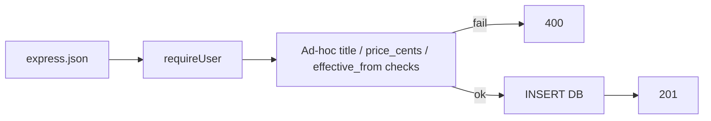
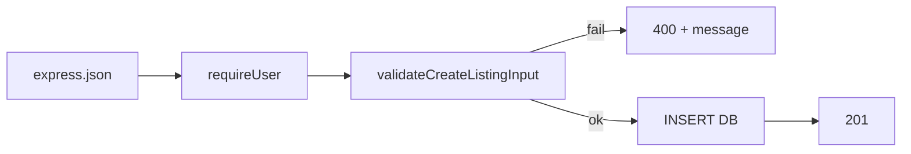
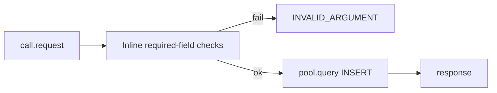
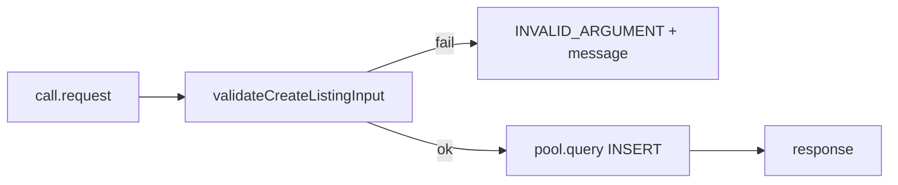
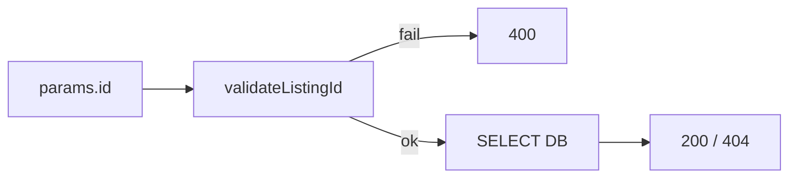

# Deep PR review: teammate branch `fix/listings-validation-response-handling`

**Teammate PR intent (summary):** Centralize listings input validation in `validation.ts`, apply it to gRPC and HTTP handlers, validate create payloads and listing IDs, validate search filters (`min_price` / `max_price` including `min > max`), reject bad UUIDs before DB, clearer 4xx errors, less duplication. Closes #4. Build: `pnpm --filter listings-service build` passes.

**PR branch:** `origin/fix/listings-validation-response-handling`  
**Reviewed tip:** `a57d97b` (“Apply shared validation and search filter checks to HTTP listing handlers”)  
**Merge base with `origin/main`:** `e37a775` (used for “before” handler behavior)

**Phase A method:** Isolated execution context — **not** a hybrid merge:

```bash
git fetch origin
git worktree add -b review-listings-validation /tmp/och-review-listings-validation origin/fix/listings-validation-response-handling
cd /tmp/och-review-listings-validation && pnpm install && pnpm --filter listings-service build
```

(Equivalent to `git checkout -b review-listings-validation origin/fix/listings-validation-response-handling` in a clean clone.) **Build: passed** on review tip.

**Phase B:** k6 from repo root on **`main`** workspace against live edge `https://off-campus-housing.test` — see §G. **Deployed cluster may not yet include the PR image**; malformed “prefer 400” checks are the canary for rollout.

**Do not merge** the teammate PR until Phase B is re-run against a **listings image built from this branch** if you need proof of 400 behavior under abuse load.

---

## A. Validation hot-path analysis (`services/listings-service/src/validation.ts`)

| # | Question | Answer |
|---|----------|--------|
| A.1 | Does `validation.ts` allocate objects per request? | **Yes** — each call returns a fresh `{ ok: true \| false, … }` and, on success, a new `ValidatedCreateListingInput` / `ValidatedSearchFilters`. Small, bounded allocations. |
| A.2 | Are regexes compiled once or per call? | **Per call for UUID:** `isValidUuid` assigns `const uuidRegex = /^[0-9a-f]{8}-…$/i` **inside** the function, so each invocation creates a **new** `RegExp` instance. **`isValidDateString`** uses an inline `/^\d{4}-\d{2}-\d{2}$/.test(value)` — the literal is evaluated each call (new `RegExp` per spec). **Hoist** both to module-level constants for a predictable win under abuse. |
| A.3 | UUID pattern: global constant or inline? | **Inline inside `isValidUuid`** — not a shared module-level constant yet. |
| A.4 | `Number()` repeatedly? | **`parsePositiveInteger` / `parseOptionalNonNegativeInteger`** each call `Number(value)` once per field. No double-parse of the same field in one path. |
| A.5 | Error strings dynamic? | **Static messages** (`"title required"`, `"min_price cannot be greater than max_price"`, etc.). No large or user-controlled concatenation. |
| A.6 | Thrown or returned? | **Returned** — `ValidationResult<T>`; handlers branch on `ok`. |
| A.7 | Stack trace captured? | **No** — validation failures are not thrown from `validation.ts`. |
| A.8 | `try/catch` on every request? | **Not in validation.** HTTP route handlers still use `try/catch` for unexpected errors (500 path). |

**Cost model:** Sync CPU + small heap allocations + **regex allocation per UUID/date check** (main optimization lever). No I/O, no async inside validation.

---

## B. Handler path — before vs after (merge base `e37a775` vs PR tip `a57d97b`)

### B.1 HTTP `POST /create`

**Before:**

1. `express.json`  
2. `requireUser` → `401` if missing `x-user-id`  
3. Read `body`; `String(title)`, `Number(price_cents)`, `String(effective_from)`  
4. If `!title \|\| !effective_from \|\| !Number.isFinite(price_cents) \|\| price_cents <= 0` → **400**  
5. `pool.query(INSERT …)`  
6. **201**

**After:**

1. `express.json`  
2. `requireUser`  
3. **`validateCreateListingInput({ ...body, user_id: req.userId }, { requireUserId: true })`** → **400** with message if invalid (UUID user, dates, price integer, etc.)  
4. `pool.query(INSERT …)` with normalized fields  
5. **201**

**Insert shape:** At merge base and on the PR tip, HTTP `INSERT` lists the **same columns** (no latitude/longitude in this lineage — if another branch adds geo, reconcile during integration).

### B.2 HTTP `GET /listings/:id`

**Before:** Immediate `pool.query(… $1::uuid …, [req.params.id])` — invalid UUID → driver/Postgres error → **`catch` → 500**.  

**After:** **`validateListingId(req.params.id)`** → **400** if bad → **no DB**.

### B.3 HTTP `GET /` / `GET /search`

**Before:** `Number(min_price)`, `Number(max_price)`; no `min > max` guard.  

**After:** **`validateSearchFilters`** first → **400** on invalid integers, negative, or **`min_price > max_price`** → **no DB** on failure.

### B.4 gRPC `CreateListing`

**Before:** If missing `user_id`, `title`, `effective_from`, or invalid `price_cents` → **`INVALID_ARGUMENT`** with a single generic message; else **`pool.query(INSERT …)`**.  

**After:** **`validateCreateListingInput(req, { requireUserId: true })`** → **`INVALID_ARGUMENT`** with **field-specific** message; else **`pool.query`**.

### B.5 gRPC `GetListing`

**Before:** `String(listing_id)`; if empty → `INVALID_ARGUMENT`; else **`pool.query`** — bad UUID could hit DB error → **INTERNAL**.  

**After:** **`validateListingId(call.request?.listing_id)`** → **`INVALID_ARGUMENT`** if malformed → **no DB**.

### Diagrams

**HTTP create — before (`e37a775`):**



**HTTP create — after (PR):**



**gRPC `CreateListing` — before:**



**gRPC `CreateListing` — after:**



**HTTP GET by id — after:**



---

## C. DB call protection

| Scenario | Before merge base | After PR |
|----------|-------------------|----------|
| Malformed listing UUID (HTTP GET) | SQL attempted → often **500** | **400**, **no** `pool.query` |
| Invalid min/max / min > max (HTTP search) | Query could run with **NaN** / odd filters | **400** before `pool.query` |
| Malformed create | Partial checks; DB could still error | **400** before INSERT |
| gRPC bad `listing_id` | DB error possible | **INVALID_ARGUMENT** before SELECT |

**Confirmed in code:** On refactored paths, **`pool.query` runs only after validation succeeds** (or health/metrics routes). Validation is synchronous — no hidden await before the guard.

---

## D. Concurrency safety

- **No shared mutable state** in `validation.ts` for request fields (pure functions + returned objects).  
- **No global caches** in the validation module.  
- **No races** — single-threaded Node event loop; per-request locals.  
- **Non-pure:** allocations and `Date` parsing in `isValidDateString` only.

---

## E. Micro-optimization opportunities (pre-merge if profiling shows hot path)

1. **Hoist** `UUID_RE` and date-line regex to **module scope**; reuse `.test()`.  
2. Optional **fast path** for UUID: length 36 + dash indices + hex nibbles before regex (measure).  
3. **`parseInt(s, 10)`** vs `Number` for query params if strings dominate (minor).  
4. **Early returns** already ordered (user id → title → price → dates → search min/max).

---

## F. Integration note (other branches)

If **`main`** (or another integration branch) added **latitude/longitude** to listings create, compare that with **`fix/listings-validation-response-handling`** before merging — the PR tip’s HTTP/gRPC INSERTs match **`e37a775`** column lists, not necessarily every experimental branch.

---

## G. Phase B — metrics (lab snapshot)

**Environment:** Local k6 → edge `https://off-campus-housing.test`, `SSL_CERT_FILE=$PWD/certs/dev-root.pem`.  
**Log file:** `bench_logs/perf-teammate-pr-phase-b-20260324-154300.log`  
**Date:** 2026-03-24 (run on **`main`** tree; cluster image may differ from PR tip).

### G.1 Listings health (`k6-listings-health.js`, default 20s, 6 VUs)

| Metric | Value |
|--------|--------|
| med (p50) | 16.65 ms |
| p(95) | 70.24 ms |
| p(99) | 276.77 ms |
| max | 636.73 ms |
| RPS | ~74.2 |

### G.2 Listings concurrency (`k6-listings-concurrency.js`, full ramp ~40s)

| Metric | Value |
|--------|--------|
| med | 21.82 ms |
| p(95) | 113.14 ms |
| p(99) | 267.89 ms |
| max | 1.32 s |
| RPS | ~77.5 |

### G.3 Malformed input (`k6-listings-malformed.js`)

Cases exercised include invalid UUID, `min_price > max_price`, negative price, string price, huge price, empty POST body.

| Metric | Value |
|--------|--------|
| http_req_duration med | 147.53 ms |
| http_req_duration p(95) | 1.07 s |
| http_req_duration max | 1.85 s |
| http_reqs | 799 total (~22.8/s) |

**Interpretation:** Thresholds on **failure rate** passed. Several checks **“prefer 400 validation” failed** in this run because the **live cluster** did not consistently return **400** for bad search filters / GET id (responses still often **200** with full search work → **high tail latency**). After deploying **`listings-service` built from `fix/listings-validation-response-handling`**, re-run and expect **“prefer 400”** checks to flip **green** and **p95** on malformed load to **drop** (cheap validation vs DB search).

### G.4 Dual-service contention

| `DUAL_PAIR` | med | p(95) | p(99) | max | RPS |
|-------------|-----|-------|-------|-----|-----|
| `messaging+listings` | 10.55 ms | 40.23 ms | 82.96 ms | 486.26 ms | ~95.1 |
| `analytics+listings` | 16.22 ms | 72.28 ms | 218.61 ms | 659.06 ms | ~81.5 |

**vs listings-health baseline:** Dual scenarios stay in the same ballpark as short health probes at p95; full comparison to a **pre-deploy** baseline should use the same log format after swapping only the listings image.

### G.5 Summary table (this run)

| Script | p50 (med) | p95 | p99 | max | ~RPS |
|--------|-----------|-----|-----|-----|------|
| listings-health | 16.65 ms | 70.24 ms | 276.77 ms | 636.73 ms | 74.2 |
| listings-concurrency | 21.82 ms | 113.14 ms | 267.89 ms | 1.32 s | 77.5 |
| listings-malformed | 147.53 ms | 1.07 s | — | 1.85 s | (mixed) |
| dual messaging+listings | 10.55 ms | 40.23 ms | 82.96 ms | 486.26 ms | 95.1 |
| dual analytics+listings | 16.22 ms | 72.28 ms | 218.61 ms | 659.06 ms | 81.5 |

---

## H. Phase B commands

```bash
pnpm --filter listings-service build

SSL_CERT_FILE="$PWD/certs/dev-root.pem" k6 run scripts/load/k6-listings-health.js
SSL_CERT_FILE="$PWD/certs/dev-root.pem" k6 run scripts/load/k6-listings-concurrency.js
SSL_CERT_FILE="$PWD/certs/dev-root.pem" k6 run scripts/load/k6-listings-malformed.js

SSL_CERT_FILE="$PWD/certs/dev-root.pem" DUAL_PAIR=messaging+listings k6 run scripts/perf/k6-dual-service-contention.js
SSL_CERT_FILE="$PWD/certs/dev-root.pem" DUAL_PAIR=analytics+listings k6 run scripts/perf/k6-dual-service-contention.js
```

pnpm shortcuts (if defined in root `package.json`): `pnpm run k6:listings:concurrency`, `pnpm run k6:listings:malformed`, `pnpm run k6:dual:contention`.

---

## I. Merge gate (teammate PR)

1. **`pnpm --filter listings-service build`** on PR tip — **done** (isolated worktree).  
2. **Code review** — Sections A–F: **no correctness blockers** identified; regex hoist is optional perf.  
3. **Deploy listings image from PR** → re-run **§G** malformed script → **“prefer 400”** should pass; **p95** on malformed load should improve vs cluster without validation.  
4. If **p95 regresses** on healthy paths vs baseline at same load — profile **`validation.ts`** (regex hoist first).  
5. **Do not** mix unlabeled perf branches with this merge without documenting which image ran.

---

## J. Related docs

- [LISTINGS_VALIDATION_PR_REVIEW_fix-listings-validation.md](./LISTINGS_VALIDATION_PR_REVIEW_fix-listings-validation.md) — short checklist.  
- [PERF_EXECUTION_ORDER_PHASES_A_B_C.md](./PERF_EXECUTION_ORDER_PHASES_A_B_C.md) — phased order.
